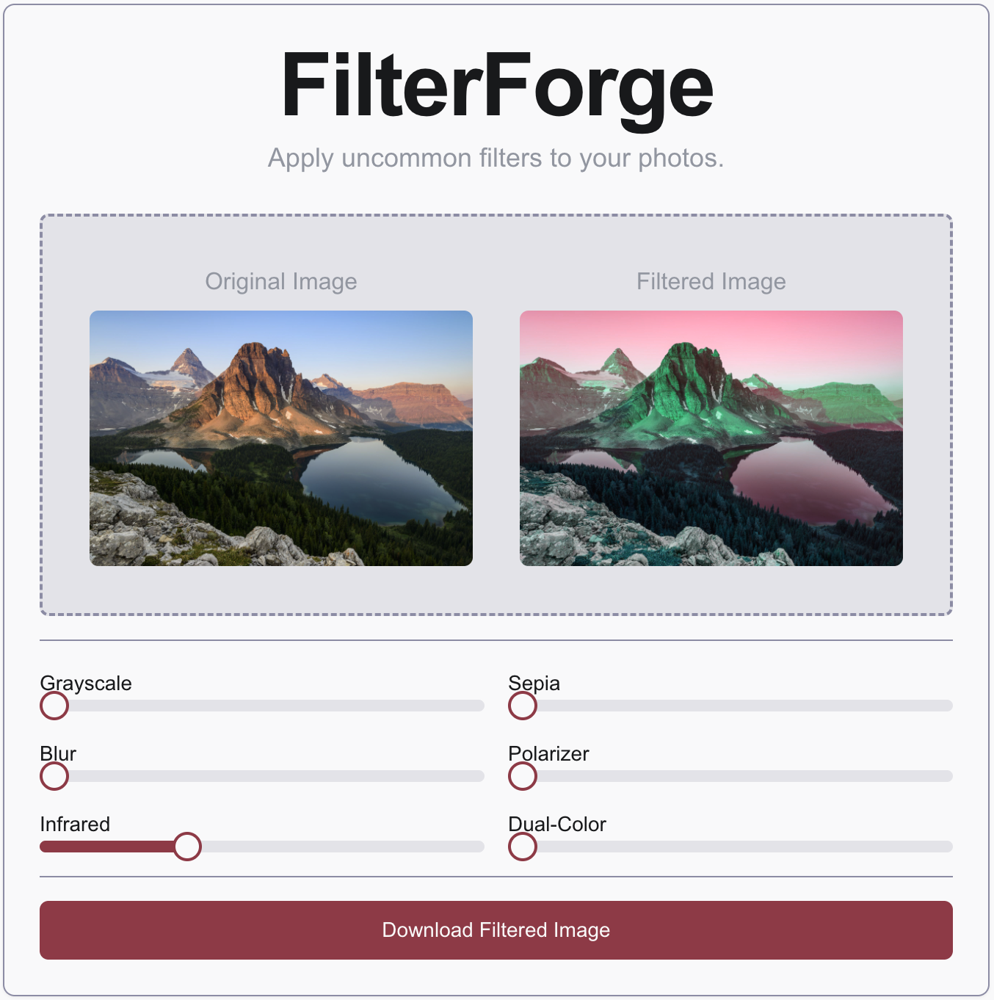

<h1>
FilterForge 🎨
</h1>

<h2>
<a href=https://studio--filterforge-bpwk4.us-central1.hosted.app/)>🚀 Live Demo
</a></h2>

---

<h2>Table of Contents</h2>

- <a href="#motivation">Motivation</a>  
- <a href="#features">Features</a>  
- <a href="#demo">Demo</a>  
- <a href="#tech-stack">Tech Stack</a>  
- <a href="#available-filters">Available Filters</a>  
- <a href="#contributing">Contributing</a>  
- <a href="#license">License</a>  
- <a href="#contact">Contact</a>  

---

<h2 id="motivation">Motivation</h2>

Common photo-editing apps like iPhone Photos or Instagram offer plenty of filters- but don't include the full spectrum of options. **FilterForge** was born out of a desire to explore more “uncommon” photographic transformations, letting you tweak and combine effects you don’t see every day.  

***Any suggestions for new filters are very much appreciated. See [Contributing](#contributing) below.***

---

<h2 id="features">Features</h2>

- **Upload & Preview**: Drag or select an image to instantly preview filters.  
- **Adjustable Intensity**: Fine-tune each filter’s strength on a 0–100 scale.  
- **Multiple “Uncommon” Filters**: Explore effects like Infrared, Polarizer, Dual-Color and more.  
- **Download**: Export your filtered image with one click.  
- **Responsive UI**: Built with modern React components for a sleek experience.

---

<h2 id="demo">Demo</h2>

  
*Preview of the filter controls and live preview pane.*

<h2 id="tech-stack">Tech Stack</h2>

* **Framework:** [Next.js](https://nextjs.org/) (App Router, React)
* **Language:** TypeScript
* **UI Components:** [shadcn/ui](https://ui.shadcn.com/) & [Lucide Icons](https://lucide.dev/)
* **Styling:** Tailwind CSS
* **Hosting:** Firebase

<h2 id="available-filters">Available Filters</h2>

| Name | Description |
| ---- | ----------- |
| Grayscale | Convert to black & white |
| Sepia | Warm vintage tones |
| Blur | Soft Gaussian blur |
| Polarizer | Boost contrast & color saturation |
| Infrared | Simulate infrared photography |
| Dual-Color | Mix of hue-rotate and sepia |

<h2 id="contributing">Contributing</h2>

To suggest a new filter or contribute code:

1. Fork the repository
2. Create a feature branch (git checkout -b feature/my-filter)
3. Commit your changes and push (git push origin feature/my-filter)
4. Open a pull request and describe your filter idea

*Feel free to open an issue for discussion first.*

<h2 id="license">License</h2>

This project is licensed under the [MIT License](https://www.mit.edu/~amini/LICENSE.md)

<h2 id="contact">Contact</h2>

Created by **Amir Valizadeh (vitalune)** - amirvalizadeh161@gmail.com
